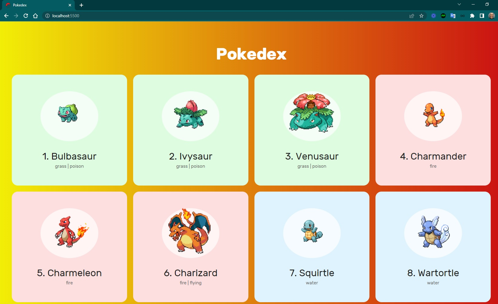
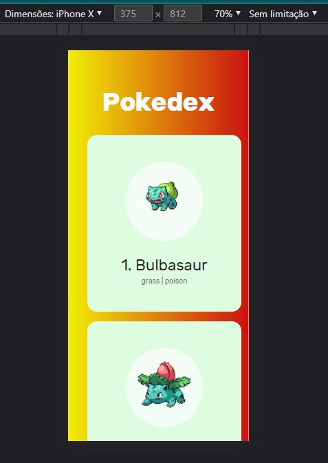

<h4 align="center"> 
	🚧 Pokedex 🚀
</h4>

  

 

#### Referências

- [Documentação Pokeapi](https://pokeapi.co/docs/v2)
- [url Nome](https://pokeapi.co/api/v2/pokemon/ditto)
- [url Pikachu](https://pokeapi.co/api/v2/pokemon/25)
- [fonte das Imagens de Pokemon](https://raw.githubusercontent.com/PokeAPI/sprites/master/sprites/pokemon/${pokemon.id}.png)

#### Requisitos

- [x] favicon
- [x] responsividade
- [x] consumir api com fetch
- [x] estilizar cards para exibir cada pokemón
- [x] corrigir possíveis warnings e registrar
- [x] registrar detalhes do projeto e as telas no readme
- [x] modolarizar a solução: código refatorado

#### Próximo passo

- [ ] criar um modal com mais informações do pokemon e exibir quando clicar no card 
- [ ] adicionar a funcionalidade de pesquisar por nome ou número de poke

#### Inspiração

- [pokemon api](https://github.com/tbone849/pokemon-guide)
- [pokedex - JavaScript puro](https://www.youtube.com/watch?v=Uptu3NrBFBM&list=PLs_UfelOxGL25jmkIJ4pU16Ku-jfdFGC4&index=6)
- [search pokemon - html css js](https://www.youtube.com/watch?v=vdytGGKyJKE&list=PLs_UfelOxGL25jmkIJ4pU16Ku-jfdFGC4&index=7)
- [pokemon - react](https://www.youtube.com/watch?v=YIzwXNLB53Q&list=PLs_UfelOxGL25jmkIJ4pU16Ku-jfdFGC4&index=7&t=412s)
- [pokemon.gameinfo](https://pokemon.gameinfo.io/)

#### Telas

  
  

 

Feito com ❤️ por Douglas A B Novato 👋🏽 [Entre em contato!](https://www.linkedin.com/in/douglasabnovato/)
Fonte do projeto é um desafio para vaga de dev.